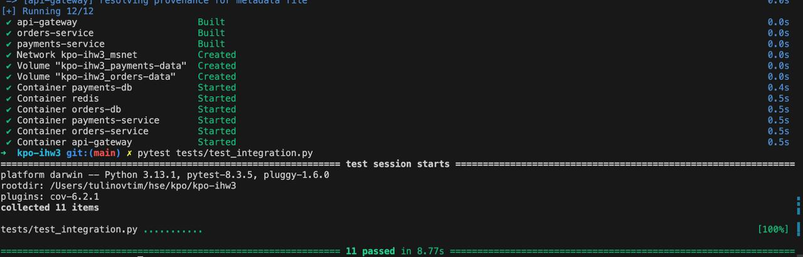

# Отчёт 

Выполнил: Тулинов Тимофей, БПИ236

## Архитектура

### Orders Service

* Создание заказа пользователя.
* Просмотр списка заказов.
* Просмотр статуса отдельного заказа.
* Использует паттерн Transactional Outbox для гарантированной отправки сообщений.
* Сервис слушает результаты оплаты через Redis и обновляет статус заказа соответственно (FINISHED/CANCELLED).

### Payments Service

* Создание счёта для пользователя (максимум один счёт на пользователя).
* Пополнение счёта пользователя.
* Просмотр текущего баланса счёта.
* Реализует паттерны Transactional Inbox и Outbox, обеспечивая exactly-once семантику при списании средств.
* Принимает запросы на оплату заказов через Redis Pub/Sub и обрабатывает их, обеспечивая атомарность операции.

### API Gateway

* Маршрутизация входящих HTTP-запросов к соответствующим микросервисам.
* Выполнен на Ocelot с возможностью конфигурирования маршрутов через файл конфигурации.

Коммуникация между сервисами осуществляется с помощью Redis Pub/Sub для асинхронной обработки сообщений.

## Реализация семантики exactly once

Для обеспечения exactly-once семантики были реализованы следующие подходы:

* Механизм оптимистичной конкурентности при работе с балансом (`RowVersion` в модели Account).
* Таблицы Inbox и Outbox в обоих сервисах обеспечивают доставку и обработку сообщений ровно один раз, предотвращая повторные списания или пропуски платежей.
* Каждый сервис имеет фоновый обработчик сообщений, проверяющий и отправляющий события.

## Инфраструктура

Все компоненты приложения упакованы в Docker-контейнеры и разворачиваются через `docker-compose`.

Структура контейнеров:

* Redis (используется для Pub/Sub).
* PostgreSQL (отдельные базы данных для Orders Service и Payments Service).
* Orders Service и Payments Service (ASP.NET Core веб-приложения).
* API Gateway (Ocelot для маршрутизации запросов).

## Тестирование

Интеграционные тесты проведены с помощью Python и Postman, обеспечивающие покрытие функционала более чем на 65%. Проверены сценарии создания счетов, пополнения баланса, создания заказов, успешной и неуспешной оплаты заказов.

## Docker и Docker Compose

Разработаны Dockerfile и docker-compose.yml файлы, обеспечивающие запуск всей инфраструктуры одной командой:

```sh
docker-compose up --build -d
```


## Документация API

Для удобства проверки и тестирования сервисов реализованы Swagger-документации:

* Orders Service: [http://localhost:5003/swagger/index.html](http://localhost:5003/swagger/index.html)
* Payments Service: [http://localhost:5002/swagger/index.html](http://localhost:5002/swagger/index.html)


# Тесты 




